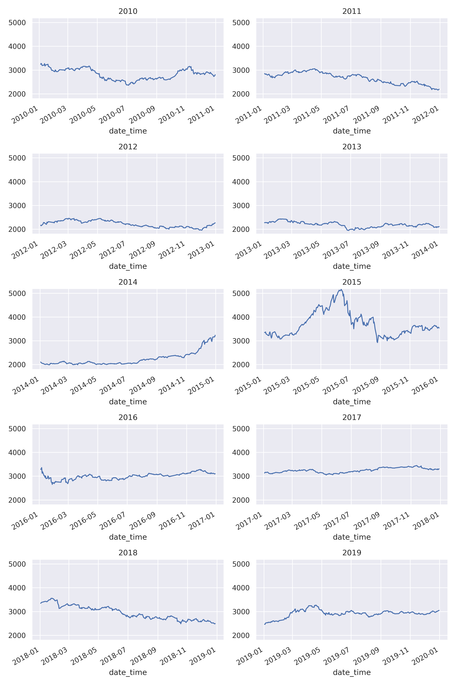
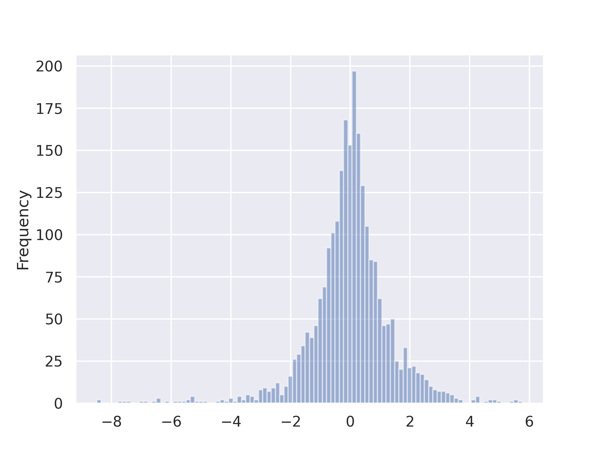
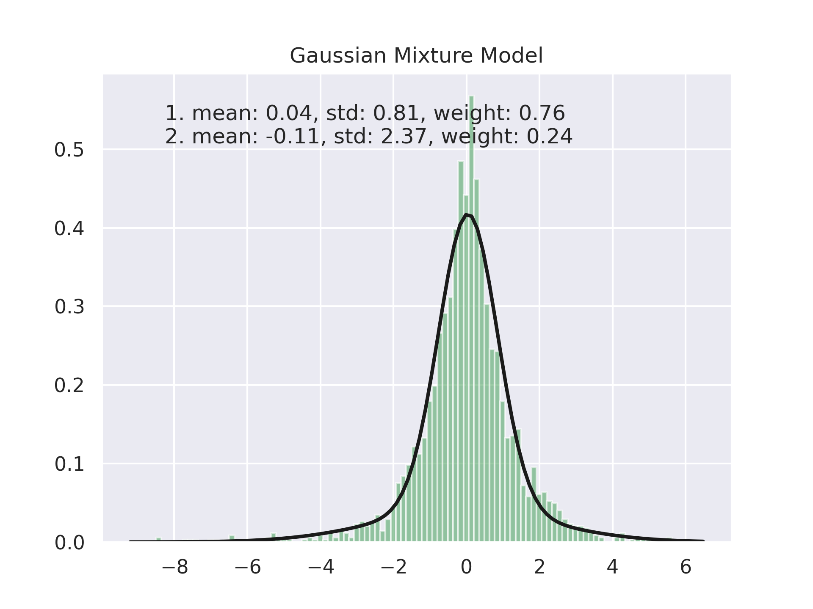
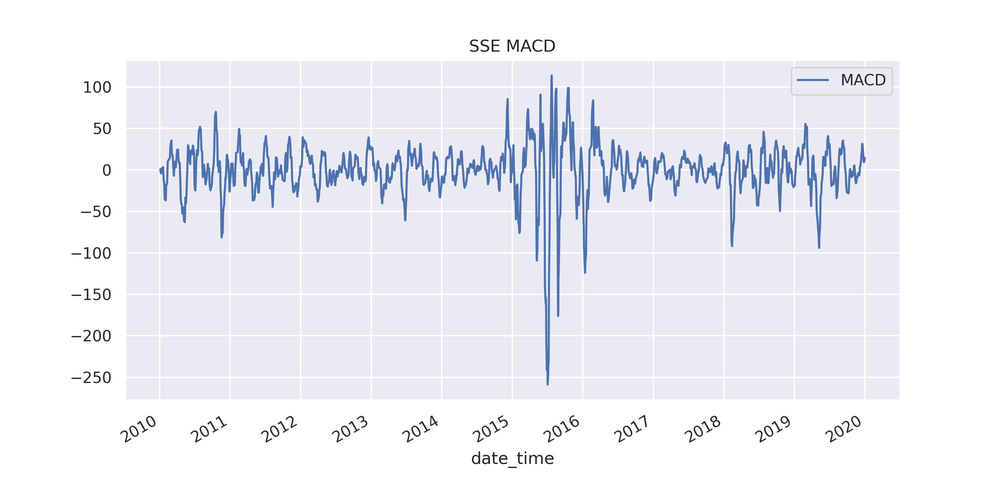

# DRL for QT
 
## Datasets

### SSE: Shanghai Stock Exchange

#### Close Price
Strong fluctuations can be observed in 2015

#### Return (log diff)
- Follows a higher peak and fat tail distribution.
(尖峰厚尾)
    - It differs from Gaussian distribution
    - This feature leads to the extension from HMM to HMM-GMD (Gaussian mixture distribution)
    - 
- Gaussian Mixture Model fit
    - 2 mixture
    - 

#### MACD
Moving Average Convergence / Divergence

