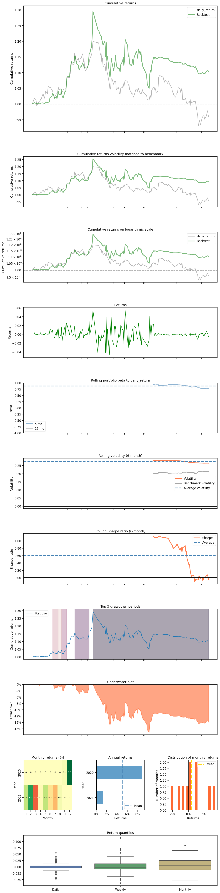
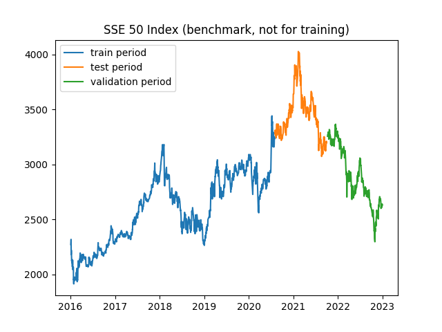
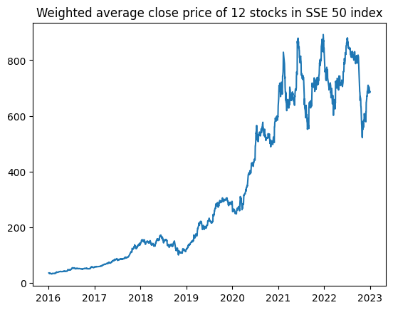

# DRL for QT

## Datasets

### SSE: Shanghai Stock Exchange

#### Close Price

Strong fluctuations can be observed in 2015

#### Return (log diff)

- Follows a higher peak and fat tail distribution.
  (尖峰厚尾)
  - It differs from Gaussian distribution
  - This feature leads to the extension from HMM to HMM-GMD (Gaussian mixture distribution)
  - 
- Gaussian Mixture Model fit
  - 2 mixture
  - 

#### MACD

Moving Average Convergence / Divergence

## Timing Strategies

### Reinforcement Learning (RL)

(not the deep methods)

#### Hidden Markov Model (HMM)

- Hidden states mining (using SSE data ranging from **2010 to 2020**)
  - 
  - 
    - Choose states 1, 4 as **BUY** signals
    - Choose states 3, 5 as **SELL** signals
- Model measurement (using SSE data ranging from **2021 to 2023**)
  - The latest (updated to 2023-03-03) annualized [risk-free rate of return](https://data.eastmoney.com/cjsj/zmgzsyl.html) for the **two-year and five-year** periods in China is **2.46% and 2.74%**, respectively
  - The model has an annual return rate **4.86%**, outperfroming risk-free return by 70%
  - 

### Deep Reinforcement Learning (DRL)

#### Problem definition

This problem is to design an automated trading solution for single stock trading. We model the stock trading process as a Markov Decision Process (MDP). We then formulate our trading goal as a maximization problem.

The algorithm is trained using Deep Reinforcement Learning (DRL) algorithms and the components of the reinforcement learning environment are:

* Action: The action space describes the allowed actions that the agent interacts with the
  environment. Normally, a ∈ A includes three actions: a ∈ {−1, 0, 1}, where −1, 0, 1 represent
  selling, holding, and buying one stock. Also, an action can be carried upon multiple shares. We use
  an action space {−k, ..., −1, 0, 1, ..., k}, where k denotes the number of shares. For example, "Buy
  10 shares of 600519.SH (贵州茅台)" or "Sell 10 shares of 600519.SH" are 10 or −10, respectively
* Reward function: r(s, a, s′) is the incentive mechanism for an agent to learn a better action. The change of the portfolio value when action a is taken at state s and arriving at new state s',  i.e., r(s, a, s′) = v′ − v, where v′ and v represent the portfolio values at state s′ and s, respectively
* State: The state space describes the observations that the agent receives from the environment. Just as a human trader needs to analyze various information before executing a trade, so
  our trading agent observes many different features to better learn in an interactive environment.
* Environment: SSE 50 Index

The data of the single stock that we will be using for this case study is obtained from Yahoo Finance API. The data contains Open-High-Low-Close price and volume.

#### A2C, PPO, DDPG models

- Backtest
  - Base rate chosen is **SSE 50 index price**, because all 12 tickets are selceted from constituent stocks of SSE 50 Index
  - The DRL model has an annual return rate **13.74%** on 12 stocks
  - The cumulative returns of the DRL algorithm trades in the backtest compared to the daily returns of the SSE 50 Index, which is the benchmark interest rate, have roughly similar trends, but the DRL model is able to mitigate the decline in returns well, demonstrating the ability to identify downside risk in the stock market. (DRL算法交易在回测中的累计收益率和作为基准利率的上证50指数的每日收益率相比，大致存在相似的变化趋势，但是DRL模型能够很好缓解收益的下降，展现出了能够识别股市下跌风险的能力。)

- Data analysis
    - Similar trends can be observed in datasets and the benmark (SSE 50 index),   
        - indicaties that the 12 stocks selected are **representative**
        - also illustrates the overall trend of **convergence changes** in the stock market
        

#### Technical indicators

- MACD: Moving Average Convergence / Divergence
  - MACD is a trend-following momentum indicator that shows the relationship between two moving averages of an asset's price.
  - MACD can be used to identify bullish and bearish signals, including crossovers and divergences between the MACD line and signal line.
  - MACD can be customized by adjusting the number of periods used for the fast and slow moving averages, as well as the signal line.
  - MACD can be used in conjunction with other technical indicators to confirm or refute potential trade signals.
  - MACD can be applied to various timeframes, making it a versatile indicator for both short-term and long-term traders.
- Boll: Bollinger Bands
  - Bollinger Bands are a type of technical analysis tool used to indicate a security's price volatility.
  - They consist of three lines: a simple moving average (usually of 20 periods), an upper band (usually two standard deviations above the moving average), and a lower band (usually two standard deviations below the moving average).
  - When the price of the security moves close to the upper or lower bands, it is considered to be relatively high or low in price, respectively.
  - Bollinger Bands can be used to identify potential buy or sell signals when the price breaks through the upper or lower bands.
  - The width of the Bollinger Bands can also be used to measure the volatility of the security, with wider bands indicating higher volatility and narrower bands indicating lower volatility.
- RSI: Relative Strength Index
  - RSI is a momentum oscillator that measures the magnitude of recent price changes to evaluate overbought or oversold conditions in an asset.
  - The RSI ranges from 0 to 100, with readings above 70 indicating overbought conditions and readings below 30 indicating oversold conditions.
  - RSI is calculated by comparing the average gain and average loss of an asset over a specified time period, typically 14 days.
  - RSI can also be used to identify bullish or bearish divergences between the RSI indicator and the price of an asset, which can signal potential trend reversals.
  - RSI is a popular technical indicator used by traders and analysts in various markets, including stocks, forex, and cryptocurrencies.
- CCI: Commodity Channel Index
  - CCI is a momentum oscillator that measures the current price level relative to an average price level over a given period of time.
  - CCI is typically used to identify overbought or oversold conditions in the market.
  - CCI generates buy and sell signals based on divergence between the indicator and the price action.
  - CCI is particularly useful in detecting price reversals and trend changes in volatile markets.
  - CCI can be applied to any financial instrument, including stocks, futures, and forex.
- DX: Directional Movement Index
  - Measures trend strength: DX is used to measure the strength of a trend in a market, indicating whether the trend is gaining or losing momentum.
  - Derived from the ADX: The DX is derived from the Average Directional Index (ADX), which is used to identify the strength of a trend.
  - Ranges from 0 to 100: DX ranges from 0 to 100, with readings above 25 indicating that a trend is strengthening and readings below 25 indicating that a trend is weakening.
  - Incorporates both positive and negative directional movement: The DX incorporates both positive and negative directional movement indicators (DMI), allowing it to capture both uptrends and downtrends.
  - Can be used to identify potential trading opportunities: DX is often used by traders to identify potential trading opportunities, such as entering or exiting a position when a trend is beginning to strengthen or weaken.
- SMA: Simple Moving Average
  - Simple Moving Average (SMA) is a commonly used technical analysis tool in finance.
  - SMA calculates the average price of an asset over a specified time period.
  - SMA is a lagging indicator, which means it is based on past price data and may not accurately predict     - SMA is widely used as a trend indicator to determine whether an asset is in an uptrend or downtrend.
  - MA can be used to identify potential buy or sell signals when the price of an asset crosses above or below its SMA.
- Turbulence
  - Increased price volatility: During turbulent periods, asset prices can fluctuate rapidly and unpredictably. This can make it more difficult for traders to execute trades at desired prices and can increase the risk of losses.
  - Breakdown of traditional market correlations: Turbulent periods can lead to a breakdown of traditional market correlations, where assets that were previously thought to be uncorrelated can suddenly become highly correlated. This can make it more difficult to diversify a portfolio and can increase the risk of losses.
  - Changes in market regimes: Turbulence can also signal a change in market regimes, where the dynamics that previously drove market movements are no longer effective. This can make it more difficult for traders to predict future market movements and can increase the risk of losses.
- P/B: price-to-book ratio
  - It measures the market value of a company relative to its book value, providing insight into the company's valuation.
  - A P/B ratio below 1 suggests that the company may be undervalued, while a ratio above 1 suggests that the company may be overvalued.
  - The P/B ratio is particularly useful in evaluating the value of asset-heavy companies, such as those in the financial and industrial sectors, as it takes into account the company's assets and liabilities.
