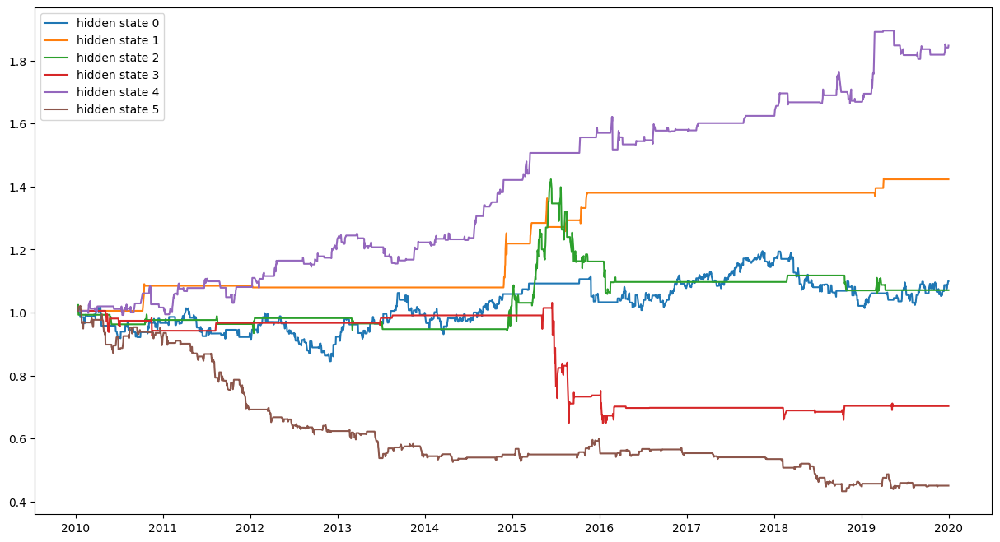

# DRL for QT
 
## Datasets

### SSE: Shanghai Stock Exchange

#### Close Price
Strong fluctuations can be observed in 2015

#### Return (log diff)
- Follows a higher peak and fat tail distribution.
(尖峰厚尾)
    - It differs from Gaussian distribution
    - This feature leads to the extension from HMM to HMM-GMD (Gaussian mixture distribution)
    - 
- Gaussian Mixture Model fit
    - 2 mixture
    - 

#### MACD
Moving Average Convergence / Divergence

## Timing Strategies

### Reinforcement Learning 
(not the deep methods)

#### Hidden Markov Model (HMM)
- Hidden states mining (using SSE data ranging from **2010 to 2020**)
    - 
    - 
        - Choose states 1, 4 as **BUY** signals
        - Choose states 3, 5 as **SELL** signals
- Model measurement (using SSE data ranging from **2021 to 2023**)
    - The latest (updated to 2023-03-03) annualized [risk-free rate of return](https://data.eastmoney.com/cjsj/zmgzsyl.html) for the **two-year and five-year** periods in China is **2.46% and 2.74%**, respectively
    - The model outperfroms risk-free return by 70%
    -  